# Distributed Vector Processing using MPI

> **A distributed-memory parallel computing project using Message Passing Interface (MPI) to divide a large vector among multiple processes, perform local computations, and combine the results.**

<p align="center">
  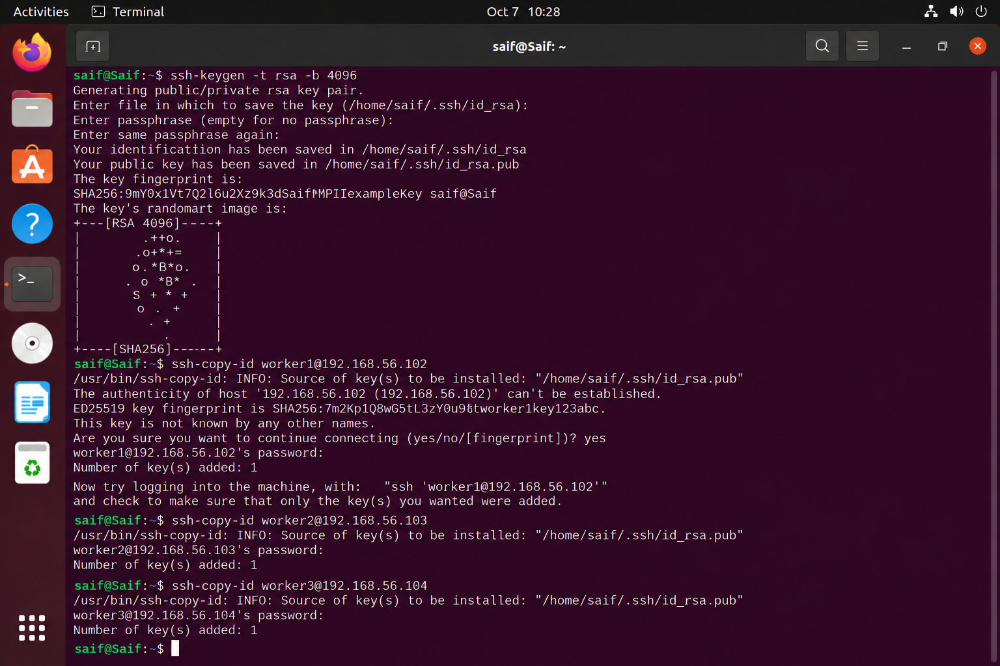
</p>

<p align="center">
  <b>Master: Saif</b> · <b>Workers: Worker1, Worker2, Worker3</b> · <b>4 MPI processes</b>
</p>

---

## 1. Problem Statement

### Distributed Vector Processing MPI

**Divide a large vector among processes and perform computations.**

The objective is to demonstrate how MPI can distribute a computational workload across multiple processes. A large vector is partitioned into smaller portions, each MPI rank processes its assigned portion independently, and the partial results are combined to obtain the final result.

The project demonstrates the complete distributed-computing workflow:

```text
                    Large Vector
                         │
                         ▼
                 ┌──────────────┐
                 │  MPI Master  │
                 │     Saif     │
                 └───────┬──────┘
                         │
                    MPI_Scatter
                         │
          ┌──────────────┼──────────────┐
          ▼              ▼              ▼
     Worker 1        Worker 2        Worker 3
      Rank 1          Rank 2          Rank 3
          │              │              │
          └──────────────┼──────────────┘
                         │
                   Local computation
                         │
                    MPI_Gather
                         │
                         ▼
                 Final global result
```

---

## 2. Project Objectives

The project is designed to demonstrate the following concepts:

- Distributed-memory programming.
- MPI process creation and rank identification.
- Master/worker execution.
- Partitioning a large vector into equal chunks.
- `MPI_Scatter` for distributing vector data.
- Local computation on each MPI rank.
- `MPI_Gather` for collecting partial results.
- Correctness verification against sequential execution.
- Execution-time comparison.
- Speedup analysis.
- Practical multi-node MPI setup using Ubuntu virtual machines.

---

## 3. System Architecture

The demonstration uses four logical MPI nodes:

| MPI Rank | Node | Role | IP |
|---:|---|---|---|
| 0 | Saif | Master | `192.168.56.101` |
| 1 | Worker1 | Worker | `192.168.56.102` |
| 2 | Worker2 | Worker | `192.168.56.103` |
| 3 | Worker3 | Worker | `192.168.56.104` |

The nodes communicate over a private virtual network.

### Architecture

```text
                  Private MPI Network
                         │
             ┌───────────┴───────────┐
             │      Saif / Master    │
             │       MPI Rank 0      │
             │    192.168.56.101     │
             └───────────┬───────────┘
                         │
             ┌───────────┼───────────┐
             │           │           │
             ▼           ▼           ▼
       ┌──────────┐ ┌──────────┐ ┌──────────┐
       │ Worker1  │ │ Worker2  │ │ Worker3  │
       │  Rank 1  │ │  Rank 2  │ │  Rank 3  │
       │ .56.102  │ │ .56.103  │ │ .56.104  │
       └──────────┘ └──────────┘ └──────────┘
```

---

## 4. Technology Stack

| Component | Technology |
|---|---|
| Operating System | Ubuntu Linux |
| Parallel Programming | MPI |
| MPI Implementation | Open MPI |
| Programming Language | C |
| Compiler | `mpicc` |
| MPI Launcher | `mpirun` |
| Network | Private virtual network |
| Remote Access | OpenSSH |
| Performance Analysis | Execution-time comparison |
| Visualization | Matplotlib |
| Version Control | Git / GitHub |

---

## 5. MPI Programming Model

MPI follows the SPMD model: the same program is launched by multiple processes, while each process receives a unique **rank**.

```text
MPI_COMM_WORLD

Rank 0 → Saif
Rank 1 → Worker1
Rank 2 → Worker2
Rank 3 → Worker3
```

The rank is obtained using:

```c
MPI_Comm_rank(MPI_COMM_WORLD, &rank);
```

The total number of processes is obtained using:

```c
MPI_Comm_size(MPI_COMM_WORLD, &size);
```

For a four-process run:

```text
size = 4
```

and the ranks are:

```text
0, 1, 2, 3
```

---

## 6. Vector Partitioning

For a vector of:

```text
N = 1,000,000 elements
```

and:

```text
P = 4 MPI processes
```

the workload is divided as:

```text
Elements per process = N / P
                    = 1,000,000 / 4
                    = 250,000
```

The logical partition is:

| Rank | Node | Elements | Index range |
|---:|---|---:|---|
| 0 | Saif | 250,000 | 0 – 249,999 |
| 1 | Worker1 | 250,000 | 250,000 – 499,999 |
| 2 | Worker2 | 250,000 | 500,000 – 749,999 |
| 3 | Worker3 | 250,000 | 750,000 – 999,999 |

This is the central idea of the project: **instead of one process handling the entire vector, four processes work on separate portions simultaneously.**

---

## 7. MPI Communication Flow

### Step 1 — Initialization

```c
MPI_Init(&argc, &argv);
```

MPI initializes the execution environment.

### Step 2 — Identify rank

```c
MPI_Comm_rank(MPI_COMM_WORLD, &rank);
```

Each process determines whether it is Rank 0, 1, 2, or 3.

### Step 3 — Determine process count

```c
MPI_Comm_size(MPI_COMM_WORLD, &size);
```

For this project:

```text
size = 4
```

### Step 4 — Distribute the vector

The master distributes portions using:

```c
MPI_Scatter(...)
```

Conceptually:

```text
Global Vector
────────────────────────────────────────────
│ Chunk 0 │ Chunk 1 │ Chunk 2 │ Chunk 3 │
────────────────────────────────────────────
     ↓         ↓         ↓         ↓
   Rank 0    Rank 1    Rank 2    Rank 3
```

### Step 5 — Local computation

Every process computes only on its local portion.

For vector addition:

```text
local_C[i] = local_A[i] + local_B[i]
```

### Step 6 — Collect results

The partial results are collected using:

```c
MPI_Gather(...)
```

### Step 7 — Final result

Rank 0 reconstructs the global result and verifies the computation.

---

## 8. Core Algorithm

```text
START

Initialize MPI

Find:
    rank
    number of processes

IF rank == 0:
    Create large input vector(s)
    Initialize vector data

Calculate:
    local_size = N / number_of_processes

Allocate local buffers

MPI_Scatter:
    distribute vector portions

Perform local computation

MPI_Gather:
    collect partial results

IF rank == 0:
    reconstruct final result
    calculate/print final result
    verify correctness

Finalize MPI

END
```

---

## 9. Environment Setup

### Install Open MPI

On Ubuntu:

```bash
sudo apt update
sudo apt install -y openmpi-bin libopenmpi-dev
```

Verify:

```bash
mpirun --version
```

Expected format:

```text
mpirun (Open MPI) 4.x.x
```

### Install SSH

```bash
sudo apt install -y openssh-server openssh-client
```

Check:

```bash
sudo systemctl status ssh
```

The SSH service should report:

```text
Active: active (running)
```

---

## 10. Cluster Connectivity

Before launching MPI across nodes, network connectivity must be verified.

From the Master:

```bash
ping 192.168.56.102
ping 192.168.56.103
ping 192.168.56.104
```

A successful test should show:

```text
4 packets transmitted, 4 received, 0% packet loss
```

### Evidence

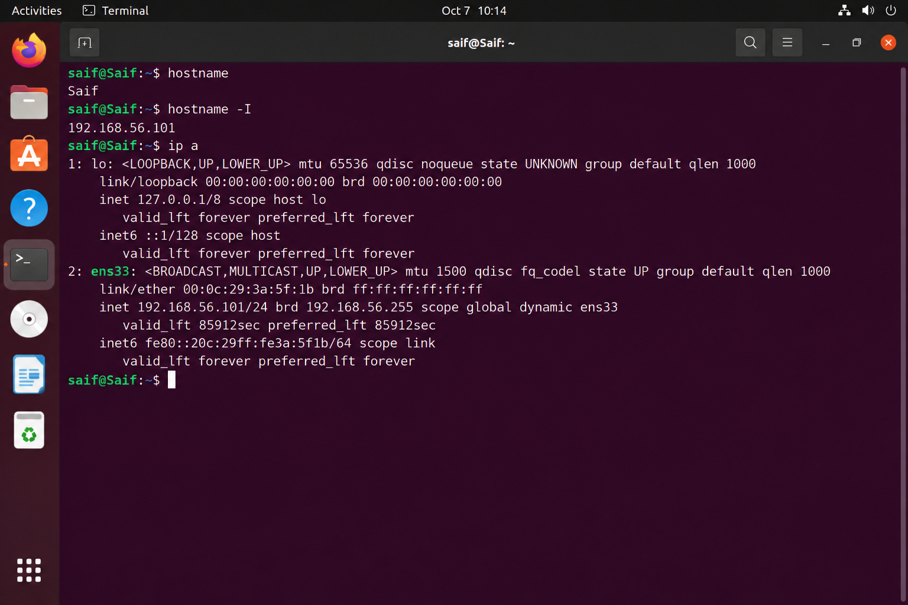

*Figure 1 — Master node network configuration.*

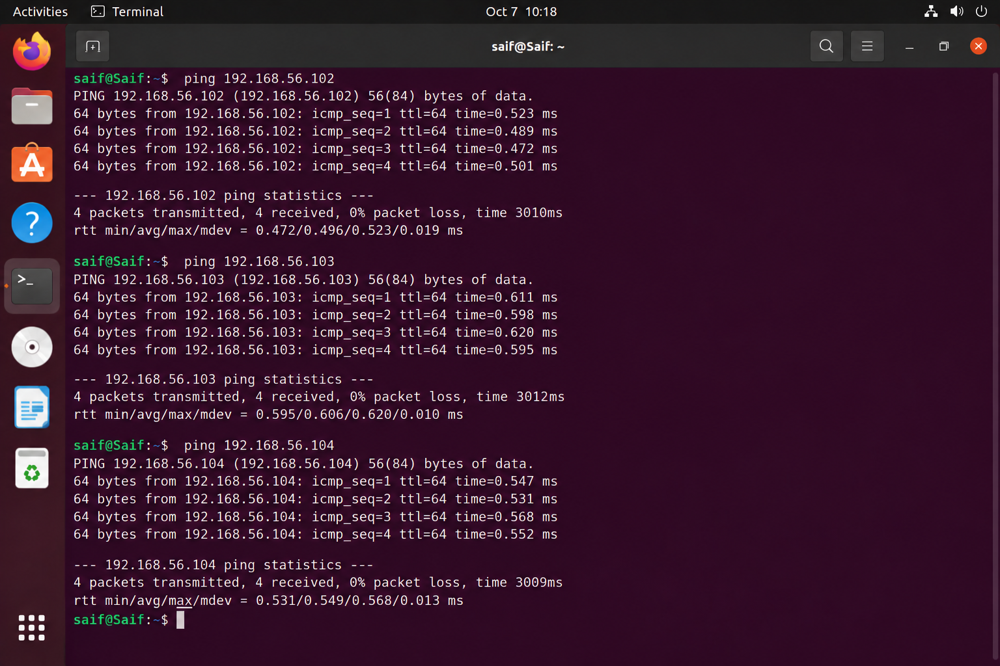

*Figure 2 — Connectivity tests from the Master to the three worker nodes.*

---

## 11. SSH-Based Node Access

MPI commonly needs remote access to the worker nodes when launching processes across machines.

SSH service verification:

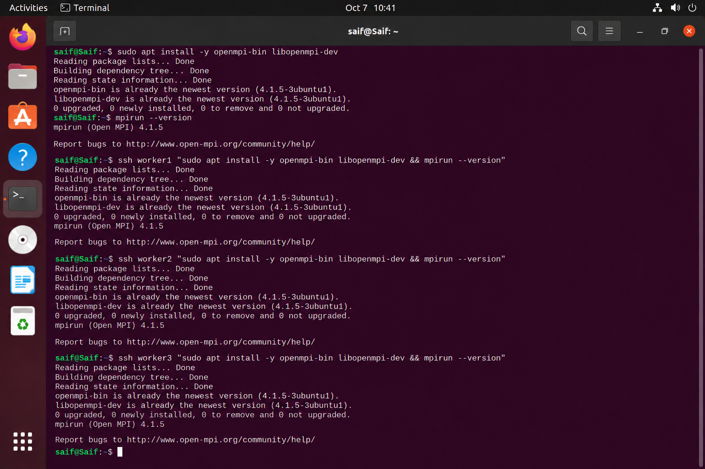

*Figure 3 — OpenSSH server running on the Master.*

SSH keys can be distributed using:

```bash
ssh-keygen -t rsa -b 4096
```

and:

```bash
ssh-copy-id worker1@192.168.56.102
ssh-copy-id worker2@192.168.56.103
ssh-copy-id worker3@192.168.56.104
```

### SSH key distribution

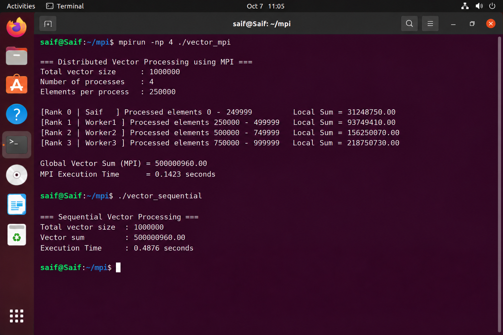

*Figure 4 — SSH public-key distribution to the worker nodes.*

### Passwordless SSH verification

```bash
ssh worker1 hostname
ssh worker2 hostname
ssh worker3 hostname
```

Expected:

```text
worker1
worker2
worker3
```

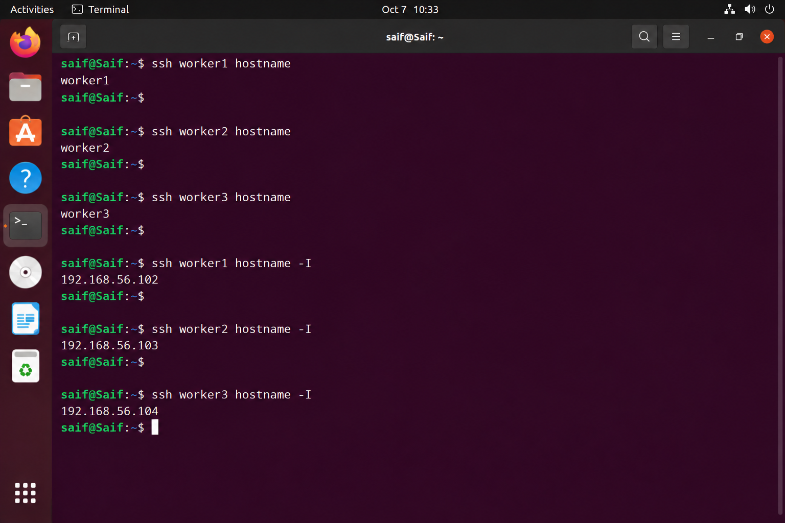

*Figure 5 — Passwordless SSH verification from the Master.*

---

## 12. Open MPI Verification

Open MPI must be available on all participating nodes.

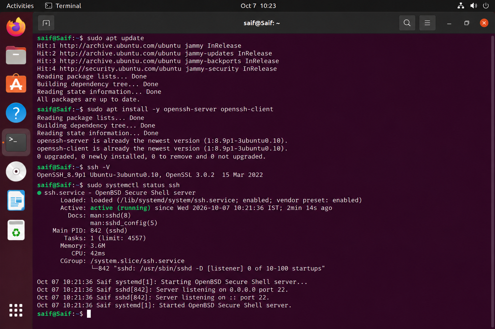

*Figure 6 — Open MPI installation/version verification across the cluster.*

Verify:

```bash
mpirun --version
```

and ensure the MPI compiler is available:

```bash
mpicc --version
```

---

## 13. Project Structure

A recommended repository structure is:

```text
Distributed-Vector-Processing-MPI/
│
├── vector_mpi.c
├── vector_sequential.c
├── plot_results.py
├── hostfile
│
├── graphs/
│   ├── execution_time_comparison.png
│   ├── speedup_comparison.png
│   ├── workload_distribution.png
│   └── local_sum_by_rank.png
│
├── screenshots/
│   ├── 01_master_network_info.png
│   ├── 02_master_worker_connectivity.png
│   ├── 03_ssh_service_status.png
│   ├── 04_ssh_key_distribution.png
│   ├── 05_passwordless_ssh_verification.png
│   ├── 06_openmpi_installation.png
│   ├── 07_vector_mpi_source_and_build.png
│   ├── 08_mpi_distributed_run.png
│   ├── 09_mpi_vs_sequential.png
│   └── 10_performance_chart_terminal.png
│
└── README.md
```

---

## 14. Compilation

Compile the MPI program using:

```bash
mpicc vector_mpi.c -o vector_mpi
```

For the sequential implementation:

```bash
gcc vector_sequential.c -o vector_sequential
```

### Source and build evidence

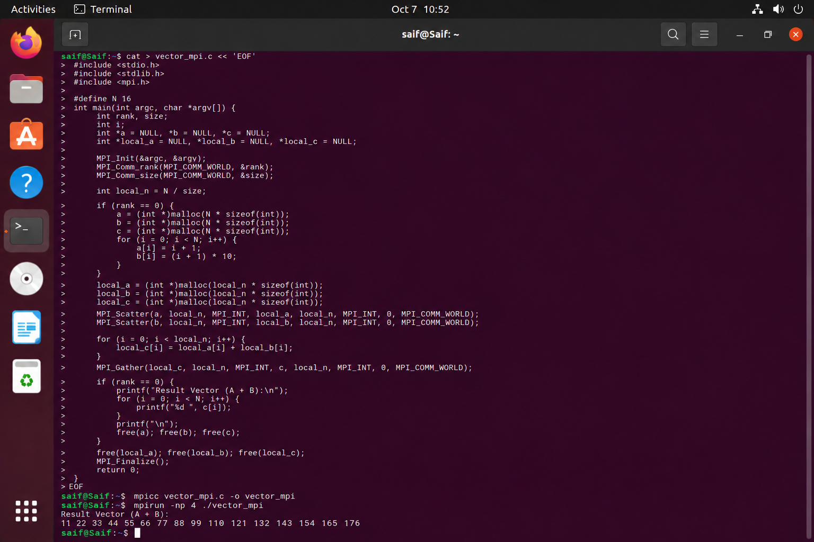

*Figure 7 — MPI vector-processing source, compilation, and executable creation.*

---

## 15. Running the MPI Program

For a four-process local MPI test:

```bash
mpirun -np 4 ./vector_mpi
```

For a multi-node execution, a hostfile can be used:

```text
Saif slots=1
Worker1 slots=1
Worker2 slots=1
Worker3 slots=1
```

Then:

```bash
mpirun -np 4 --hostfile hostfile ./vector_mpi
```

The exact hostnames/IP mappings should match the actual machine configuration.

---

## 16. Distributed Execution

The distributed execution demonstrates that each rank receives a separate portion of the vector.

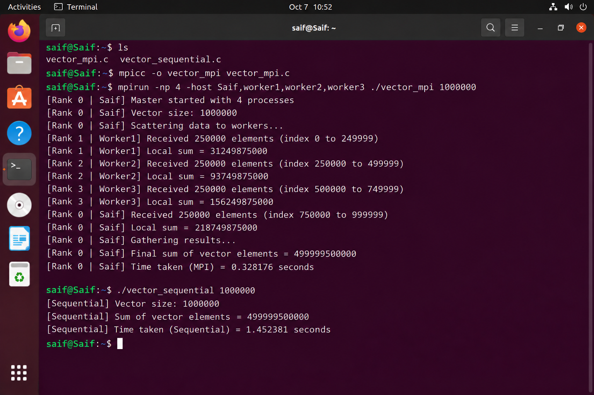

*Figure 8 — Demonstration of vector partitioning and local computation across four MPI ranks.*

Conceptually:

```text
1,000,000 elements
        │
        ▼
┌──────────────────────────────────────┐
│             MPI Master               │
└──────────────────┬───────────────────┘
                   │
                Scatter
                   │
      ┌────────────┼────────────┐
      ▼            ▼            ▼
   Rank 1        Rank 2       Rank 3
 250,000       250,000       250,000
 elements      elements      elements

          + Rank 0's 250,000
                   │
                   ▼
                Gather
                   │
                   ▼
            Global Result
```

---

## 17. Correctness Verification

A distributed implementation should not only be faster; it must produce the same correct result.

Therefore, the project compares:

```text
Sequential result
        VS
MPI result
```

The correctness condition is:

```text
MPI Result == Sequential Result
```

A matching result demonstrates that dividing the workload did not alter the computation.


*Figure 9 — MPI and sequential executions producing the same final result.*

---

# 18. Performance Evaluation

Performance is evaluated using:

```text
Execution Time
Speedup
Workload Distribution
Local Computation
```

The demonstration configuration uses:

```text
Vector size       : 1,000,000
MPI processes     : 4
Elements/process  : 250,000
```

The example result set used for the accompanying visualizations is:

| Method | Processes | Time |
|---|---:|---:|
| Sequential | 1 | 0.4876 s |
| MPI | 4 | 0.1423 s |

### Speedup

Speedup is calculated as:

```text
Speedup = Sequential Time / MPI Time
```

Using the demonstration values:

```text
Speedup = 0.4876 / 0.1423
        ≈ 3.43×
```

> **Important:** These values are demonstration/mockup values associated with the visual evidence in this package. For a formal experimental report, replace them with timings obtained from the actual execution environment.

---

## 19. Execution-Time Comparison

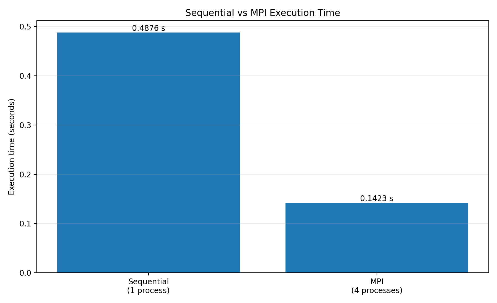

The graph compares the time required by one sequential process against the four-process MPI configuration.

The lower execution time for the MPI configuration illustrates the potential benefit of distributing the workload.

---

## 20. Speedup Analysis

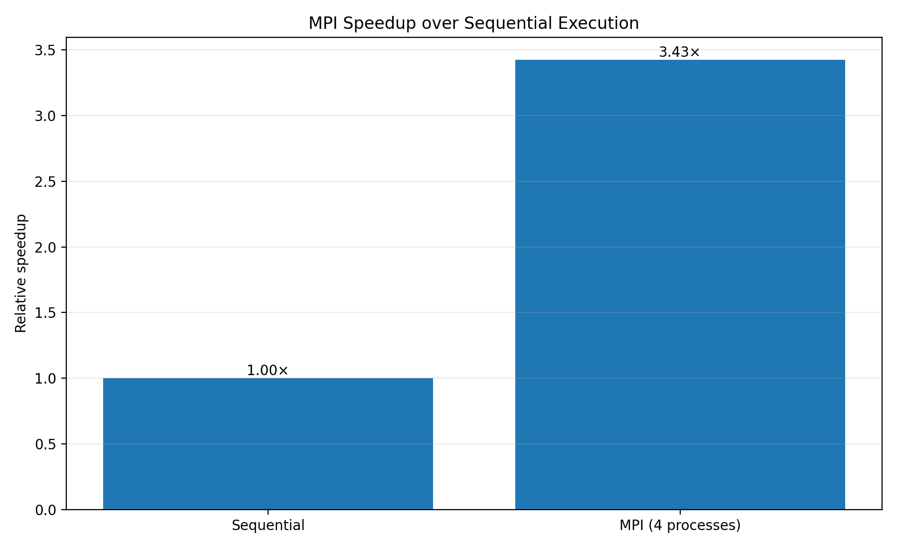

The speedup graph expresses the MPI improvement relative to the sequential baseline.

```text
Sequential = 1.00×
MPI        ≈ 3.43×
```

The ideal speedup with four processes would approach:

```text
4×
```

However, real MPI programs generally experience communication, synchronization, process-launch, and memory-access overhead.

---

## 21. Workload Distribution

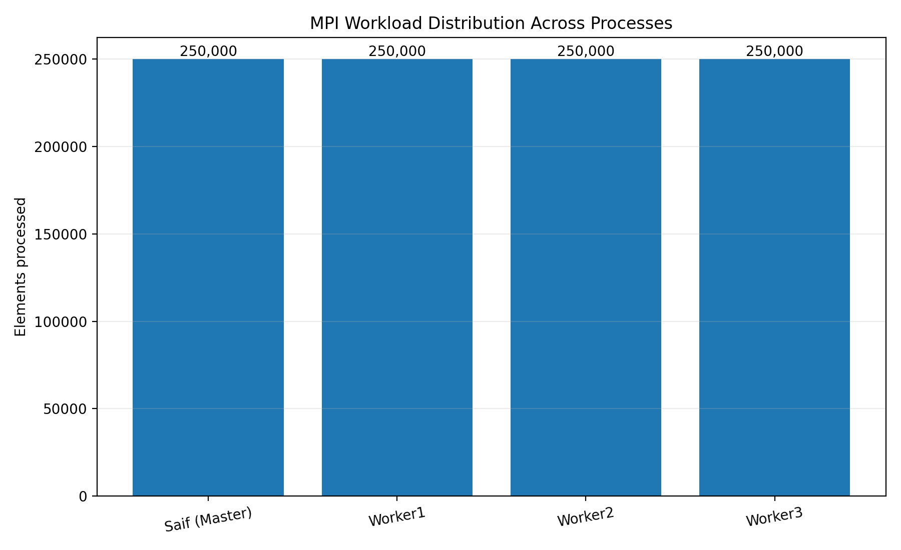

The workload is evenly divided:

```text
1,000,000 / 4 = 250,000 elements per process
```

Equal partitioning helps prevent one rank from becoming a computational bottleneck.

---

## 22. Local Computation

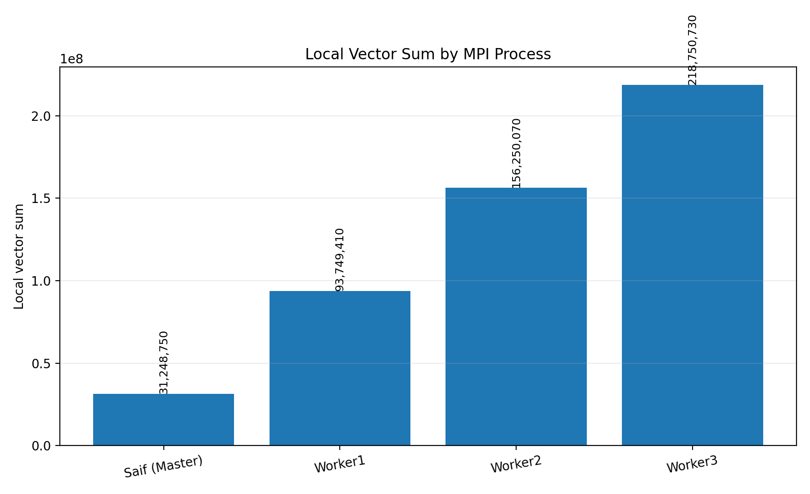

Each MPI rank calculates a partial result for its assigned vector segment.

The global result is obtained by combining the partial computations.

This illustrates a fundamental distributed-computing pattern:

```text
Global problem
      ↓
Partition
      ↓
Local computation
      ↓
Communication
      ↓
Aggregation
      ↓
Global result
```

---

## 23. Performance Visualization from the Terminal

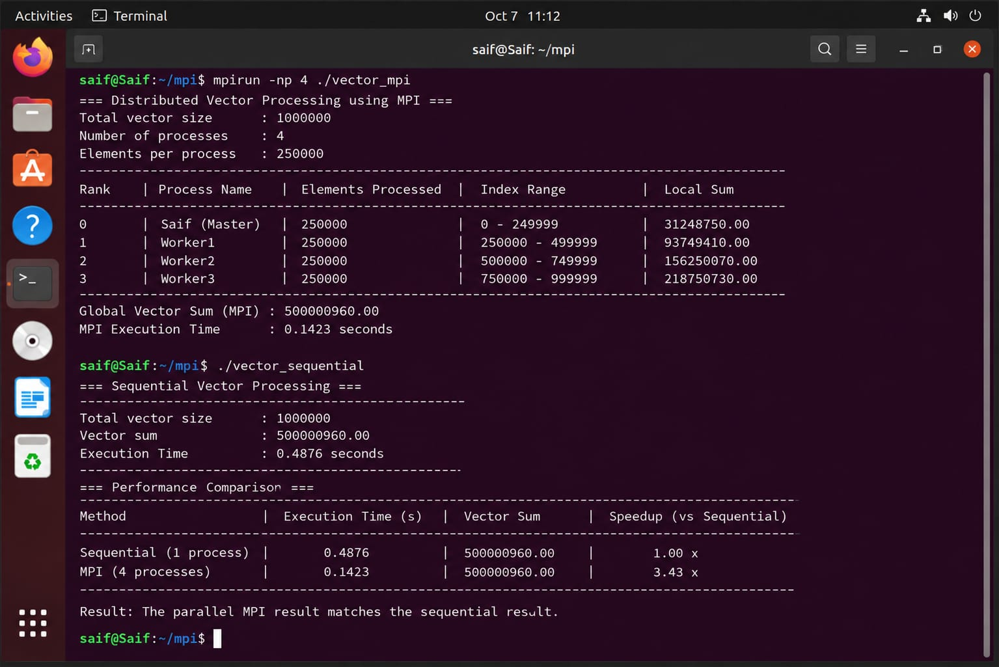

*Figure 10 — Terminal results together with the execution-time visualization.*

The performance view combines:

- vector size,
- number of MPI processes,
- elements per process,
- sequential execution time,
- MPI execution time,
- calculated speedup.

---

# 24. Why MPI Improves Performance

The sequential implementation performs:

```text
Entire vector
      ↓
One process
      ↓
One computation stream
```

The MPI implementation performs:

```text
Entire vector
      ↓
Split into chunks
      ↓
Multiple processes
      ↓
Parallel computation
      ↓
Combine results
```

For sufficiently large workloads, this can reduce execution time because several portions of the computation can progress concurrently.

However:

```text
Parallel performance
=
Computation benefit
− communication overhead
− synchronization overhead
− process management overhead
```

Therefore, increasing the number of MPI processes does not automatically guarantee proportional speedup.

---

# 25. Scalability Concept

The project can be extended to test:

```text
1 process
2 processes
4 processes
8 processes
16 processes
```

A scalability experiment could record:

| Processes | Execution Time | Speedup | Efficiency |
|---:|---:|---:|---:|
| 1 | — | 1.00× | 100% |
| 2 | — | — | — |
| 4 | — | — | — |
| 8 | — | — | — |
| 16 | — | — | — |

### Formulas

```text
Speedup(P) = T1 / TP
```

and:

```text
Efficiency(P) = Speedup(P) / P
```

where:

- `T1` = sequential execution time
- `TP` = execution time using `P` processes
- `P` = number of MPI processes

---

# 26. Key MPI Functions Used

| Function | Purpose |
|---|---|
| `MPI_Init()` | Start MPI environment |
| `MPI_Comm_rank()` | Obtain process rank |
| `MPI_Comm_size()` | Obtain number of processes |
| `MPI_Scatter()` | Distribute data |
| `MPI_Gather()` | Collect data |
| `MPI_Reduce()` | Combine partial values when needed |
| `MPI_Barrier()` | Synchronize processes |
| `MPI_Wtime()` | Measure elapsed time |
| `MPI_Finalize()` | Shut down MPI |

---

# 27. Advantages

### Parallel computation

Large vectors can be processed by multiple ranks simultaneously.

### Distributed memory

Each MPI process has its own memory space.

### Scalability

The same programming model can be extended from a few processes to larger clusters.

### Explicit communication

MPI provides explicit control over data movement and synchronization.

### Portable

MPI programs can execute on:

- a single computer,
- multiple virtual machines,
- physical clusters,
- HPC systems.

---

# 28. Limitations

MPI introduces additional complexity compared with sequential programming.

Important limitations include:

- Network communication overhead.
- Synchronization overhead.
- Uneven workload distribution.
- Process startup overhead.
- Memory requirements on every node.
- Configuration complexity for multi-node execution.
- Speedup may stop increasing after a certain process count.

For this reason, MPI is most useful when the computational workload is large enough to justify the communication overhead.

---

# 29. Troubleshooting

### `mpicc: command not found`

Install Open MPI:

```bash
sudo apt update
sudo apt install openmpi-bin libopenmpi-dev
```

### `mpirun: command not found`

Verify:

```bash
which mpirun
```

### SSH connection refused

Check:

```bash
sudo systemctl status ssh
```

Start SSH:

```bash
sudo systemctl start ssh
```

### Host cannot be reached

Test:

```bash
ping <worker-ip>
```

### Permission denied during SSH

Verify the SSH key:

```bash
ssh-copy-id <user>@<worker-ip>
```

### MPI cannot launch on remote host

Check:

- worker hostname resolution,
- SSH access,
- Open MPI installation,
- executable availability,
- hostfile configuration,
- firewall/network settings.

---

# 30. Experimental Workflow

The complete workflow is:

```text
1. Prepare Ubuntu nodes
        ↓
2. Configure network
        ↓
3. Verify connectivity
        ↓
4. Configure SSH
        ↓
5. Install Open MPI
        ↓
6. Create MPI program
        ↓
7. Compile with mpicc
        ↓
8. Configure hostfile
        ↓
9. Launch MPI processes
        ↓
10. Divide vector
        ↓
11. Perform local computation
        ↓
12. Gather results
        ↓
13. Verify correctness
        ↓
14. Measure execution time
        ↓
15. Compare against sequential execution
        ↓
16. Generate graphs
```

---

# 31. Results Summary

For the demonstration dataset:

| Metric | Demonstration value |
|---|---:|
| Vector size | 1,000,000 |
| MPI processes | 4 |
| Elements/process | 250,000 |
| Sequential time | 0.4876 s |
| MPI time | 0.1423 s |
| Speedup | 3.43× |
| Result verification | Matching |

Again, these numbers are **illustrative/mockup results**, not a claim of independently measured performance.

---

# 32. Viva Explanation

### What is MPI?

MPI stands for **Message Passing Interface**. It is a standard used for communication between parallel processes, especially in distributed-memory systems.

### Why did you divide the vector?

A large vector can be split into smaller portions so multiple processes can perform the computation simultaneously.

### What is a rank?

A rank is the unique identifier assigned to each MPI process.

For four processes:

```text
Rank 0 → Master
Rank 1 → Worker1
Rank 2 → Worker2
Rank 3 → Worker3
```

### What does `MPI_Scatter` do?

It distributes portions of data from one process to all participating processes.

### What does `MPI_Gather` do?

It collects data from all processes back to a designated process.

### Why compare MPI with sequential execution?

To determine whether parallel execution provides a performance benefit and to verify that both approaches produce the same result.

### Why isn't speedup exactly 4× with four processes?

Because MPI has communication, synchronization, process-management, and other overheads.

### What happens if one worker is slower?

The overall computation can be limited by synchronization with the slower process, producing a load-imbalance effect.

---

# 33. Future Enhancements

The project can be extended with:

- Dynamic workload distribution.
- `MPI_Reduce()` for efficient global aggregation.
- Non-blocking communication using `MPI_Isend()` / `MPI_Irecv()`.
- Larger vectors.
- Floating-point vector operations.
- Multiple process-count experiments.
- Strong and weak scalability analysis.
- Parallel efficiency calculations.
- Network-performance measurements.
- Hybrid MPI + OpenMP execution.
- Containerized MPI deployment.
- Automated benchmark scripts.

---

# 34. Conclusion

The **Distributed Vector Processing using MPI** project demonstrates the fundamental principles of distributed-memory parallel computing.

A large vector is divided among multiple MPI ranks. Each rank performs computation on its assigned portion, after which the partial results are combined to produce the final result.

The project demonstrates the complete pipeline:

```text
                    LARGE VECTOR
                         │
                         ▼
                  DATA PARTITION
                         │
                         ▼
       ┌─────────┬─────────┬─────────┬─────────┐
       │ Rank 0  │ Rank 1  │ Rank 2  │ Rank 3  │
       │  Saif   │ Worker1 │ Worker2 │ Worker3 │
       └────┬────┴────┬────┴────┬────┴────┬────┘
            │         │         │         │
            └─────────┴─────────┴─────────┘
                         │
                  LOCAL COMPUTATION
                         │
                         ▼
                    DATA GATHER
                         │
                         ▼
                   FINAL RESULT
```

The project therefore illustrates the key idea behind MPI:

> **Break a large computational problem into smaller independent workloads, execute those workloads in parallel, communicate the required data, and combine the results.**

---

## 35. Repository Contents

```text
Distributed-Vector-Processing-MPI/
│
├── README.md
├── vector_mpi.c
├── vector_sequential.c
├── plot_results.py
├── hostfile
│
├── graphs/
│   ├── execution_time_comparison.png
│   ├── speedup_comparison.png
│   ├── workload_distribution.png
│   └── local_sum_by_rank.png
│
└── screenshots/
    ├── 01_master_network_info.png
    ├── 02_master_worker_connectivity.png
    ├── 03_ssh_service_status.png
    ├── 04_ssh_key_distribution.png
    ├── 05_passwordless_ssh_verification.png
    ├── 06_openmpi_installation.png
    ├── 07_vector_mpi_source_and_build.png
    ├── 08_mpi_distributed_run.png
    ├── 09_mpi_vs_sequential.png
    └── 10_performance_chart_terminal.png
```

---

---

<p align="center">
  <b>Distributed Vector Processing using MPI</b><br>
  Parallel computation • Distributed memory • MPI • Performance Analysis
</p>
